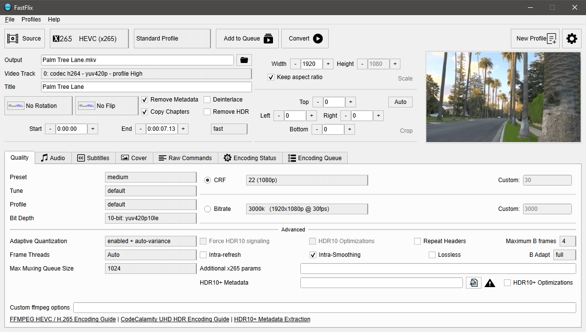

# FastFlix



FastFlix is a simple and friendly GUI for encoding videos.

[Download latest release from Github](https://github.com/cdgriffith/FastFlix/releases/latest)

FastFlix keeps HDR10 metadata for x265, which will be expanded to AV1 libraries when available.

It needs `FFmpeg` (version 4.3 or greater) under the hood for the heavy lifting, and can work with a variety of encoders.

**NEW**: Join us on [discord](https://discord.gg/GUBFP6f) or [reddit](https://www.reddit.com/r/FastFlix/)!

Check out [the FastFlix github wiki](https://github.com/cdgriffith/FastFlix/wiki) for help or more details, and please report bugs or ideas in the [github issue tracker](https://github.com/cdgriffith/FastFlix/issues)!

#  Encoders

 FastFlix supports the following encoders if available:

| Encoder   | x265 |  NVENC HEVC | [NVEncC HEVC](https://github.com/rigaya/NVEnc/releases) | x264 | rav1e | AOM AV1 | SVT AV1 | VP9 | WEBP | GIF |
| --------- | ---- | ---------- | ----------- | ---- | ----- | ------- | ------- | --- | ---- | --- |
| HDR10     |   ✓  |            |      ✓     |      |       |         |         |  ✓* |      |     |
| HDR10+    |   ✓  |            |      ✓     |      |       |         |         |     |      |     |
| Audio     |   ✓  |      ✓     |      ✓*    |  ✓   |   ✓  |    ✓    |    ✓   |  ✓   |      |     |
| Subtitles |   ✓  |      ✓     |      ✓     |  ✓   |   ✓  |    ✓    |    ✓   |      |      |     |
| Covers    |   ✓  |      ✓     |            |  ✓   |   ✓  |    ✓    |    ✓   |      |      |     |
| bt.2020   |   ✓  |     ✓      |     ✓      |   ✓  |  ✓    |   ✓    |   ✓    |  ✓   |      |     |

`✓ - Full support   |   ✓* - Limited support`

# Releases

View the [releases](https://github.com/cdgriffith/FastFlix/releases) for binaries for Windows, MacOS or Linux

You will need to have `ffmpeg` and `ffprobe` executables on your PATH and they must be executable. Version 4.3 or greater is required. The one in your in your package manager system may not support all encoders or options.
Check out the [FFmpeg download page for static builds](https://ffmpeg.org/download.html) for Linux and Mac.

## Running from source code

Requires python3.8+

```
git clone https://github.com/cdgriffith/FastFlix.git
cd FastFlix
python3 -m venv venv
. venv/bin/activate
pip install -r requirements.txt
python -m fastflix
```

# HDR

On any 10-bit or higher video output, FastFlix will copy the input HDR colorspace (bt2020). Which is [different than HDR10 or HDR10+](https://codecalamity.com/hdr-hdr10-hdr10-hlg-and-dolby-vision/).

## HDR10

FastFlix was created to easily extract / copy HDR10 data, but as of sept 2020, only x265 support copying that data through FFmpeg, no AV1 library does.

VP9 has limited support to copy some existing HDR10 metadata, usually from other VP9 files. Will have the line "Mastering Display Metadata, has_primaries:1 has_luminance:1 ..." when it works.

* rav1e -  can set mastering data and CLL via their CLI but [not through ffmpeg](https://github.com/xiph/rav1e/issues/2554).
* SVT AV1 - accepts a "--enable-hdr" flag that is [not well documented](https://github.com/AOMediaCodec/SVT-AV1/blob/master/Docs/svt-av1_encoder_user_guide.md), not supported through FFmpeg.
* aomenc (libaom-av1) - does not look to support HDR10

## HDR10+

FastFlix supports using generated or [extracted JSON HDR10+ Metadata](https://github.com/cdgriffith/FastFlix/wiki/HDR10-Plus-Metadata-Extraction) with HEVC encodes via x265. However, that is highly
dependent on a FFmpeg version that has been compiled with x265 that has HDR10+ support. [BtbN's Windows FFmpeg builds](https://github.com/BtbN/FFmpeg-Builds) 
have this support as of 10/23/2020 and may require a [manual upgrade](https://github.com/cdgriffith/FastFlix/wiki/Updating-FFmpeg).

## HLG 

FastFlix (v4.0.2+) passes through HLG color transfer information to everything except webp and GIF. 

## Dolby Vision

FastFlix does not plan to support Dolby Vision's proprietary format at this time.

# Support FastFlix

Check out the different ways you can help [support FastFlix](https://github.com/cdgriffith/FastFlix/wiki/Support-FastFlix)!

# License

Copyright (C) 2019-2021 Chris Griffith

The code itself is licensed under the MIT which you can read in the `LICENSE` file. <br>
Read more about the release licensing in the [docs](docs/README.md) folder. <br>

Encoder icons for [VP9](https://commons.wikimedia.org/wiki/File:Vp9-logo-for-mediawiki.svg) and [AOM AV1](https://commons.wikimedia.org/wiki/File:AV1_logo_2018.svg) are from Wikimedia Commons all others are self created.

Various button icons from [https://uxwing.com](https://uxwing.com)

Sample videos and thumbnail for preview image provided by [Jessica Payne](http://iamjessicapayne.com/)
