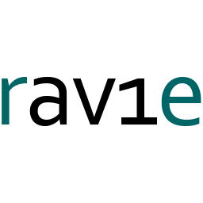
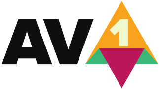

# FastFlix


FastFlix is a simple and friendly GUI for encoding videos.

It uses `FFmpeg` under the hood for the heavy lifting, and can work with a variety of encoders.

#  Encoders

 FastFlix supports the following encoders when their required libraries are found in FFmpeg:

* HEVC (libx265) &nbsp;&nbsp;&nbsp; 
* AVC (libx264) &nbsp;&nbsp;&nbsp;&nbsp;&nbsp;&nbsp; 
* AV1 (librav1e) &nbsp;&nbsp;&nbsp;&nbsp;&nbsp;&nbsp; 
* AV1 (libaom-av1) &nbsp; 
* AV1 (libsvtav1) &nbsp;&nbsp;&nbsp;&nbsp;&nbsp; 
* VP9 (libvpx) &nbsp;&nbsp;&nbsp;&nbsp;&nbsp;&nbsp;&nbsp;&nbsp;&nbsp; 
* GIF (gif) &nbsp;&nbsp;&nbsp;&nbsp;&nbsp;&nbsp;&nbsp;&nbsp;&nbsp;&nbsp;&nbsp;&nbsp;&nbsp;&nbsp;&nbsp; 

# Releases

## Windows
[](https://ci.appveyor.com/project/cdgriffith/fastflix/branch/master)

View the [releases](https://github.com/cdgriffith/FastFlix/releases) for 64 bit Windows binaries (Generated via Appveyor and also [available there](https://ci.appveyor.com/project/cdgriffith/fastflix)).

## MacOS and Linux

Please use [pipx](https://pipxproject.github.io/pipx/installation/) to install as a properly virtualized app

```
pipx install fastflix
```

## Running from source code

```
git clone https://github.com/cdgriffith/FastFlix.git
cd FastFlix
python3 -m venv venv
. venv/bin/activate
pip install -r requirements.txt
python -m fastflix
```

# License

Copyright (C) 2019-2020 Chris Griffith

The code itself is licensed under the MIT which you can read in the `LICENSE` file. <br>
Read more about the release licensing in the [docs](docs/README.md) folder. <br>
Encoder icons for [VP9](https://commons.wikimedia.org/wiki/File:Vp9-logo-for-mediawiki.svg) and [AOM AV1](https://commons.wikimedia.org/wiki/File:AV1_logo_2018.svg) are from Wikimedia Commons all others are self created.
